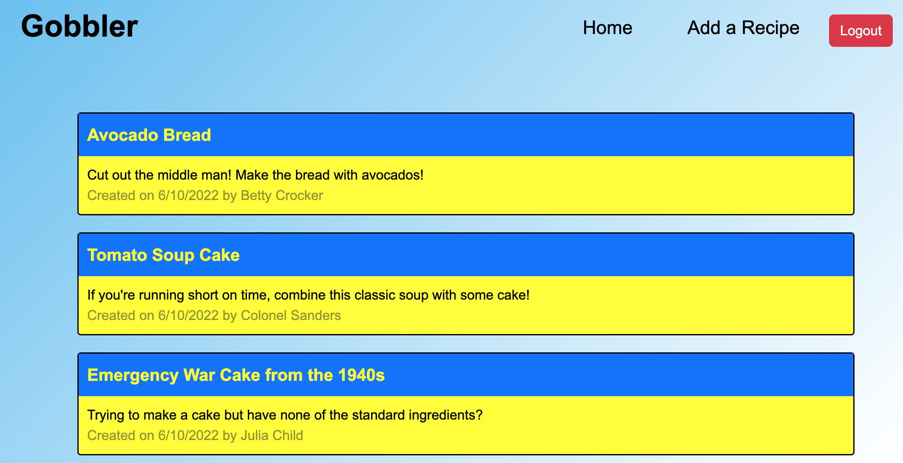
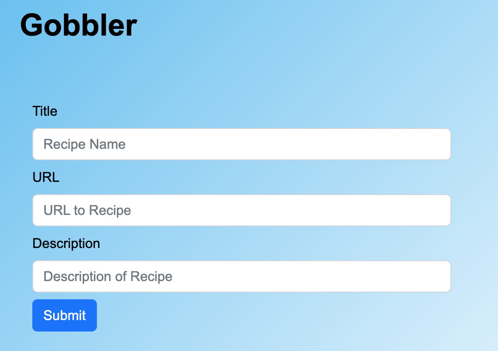
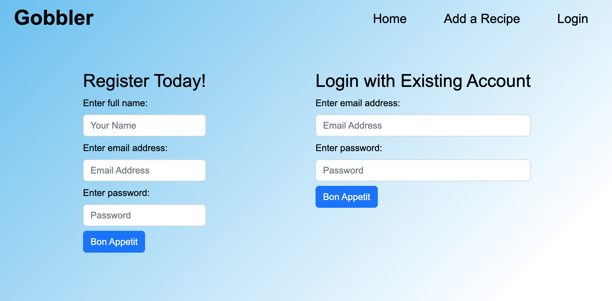

# group-6_fullstack-project

## User Story
As a User I want a blog site dedicated to hosting recipes

I want the option to create an account where I can upload my own recipes to share

I want a homepage of all recipes and URLs uploaded by other users

## Functionality

A user is presented with a homepage with a message prompting the user to login if they would like to view all recipes.

When the user clicks on the login tab they were presented with forms to either register a new account or login with an existing. 

Once the user registers an account they are logged in and redirected back to the homepage but now recipes and the option to add recipes are available.

The titles of all the recipes are links to the recipes online.

The account that was created is added to the user database and can be accessed for future use.

When the user adds a recipe from the "Add A Recipe" tab they are redirected back to the homepage and their recipe will appear at the bottom.

When the user clicks the Logout button, their session has ended.

## Technologies User

Front-end: Javascript, CSS, Bootstrap, Handlebars

Back-end: Node.js, Express.js, Bcrypt, Dotenv, MySQL 2, Sequelize

New package used: Validator NPM Package

## Preview of Application

## Links

GitHub Repository: https://github.com/randronaco1027/group-6_fullstack-project

Heroku Application: https://quiet-harbor-99755.herokuapp.com/